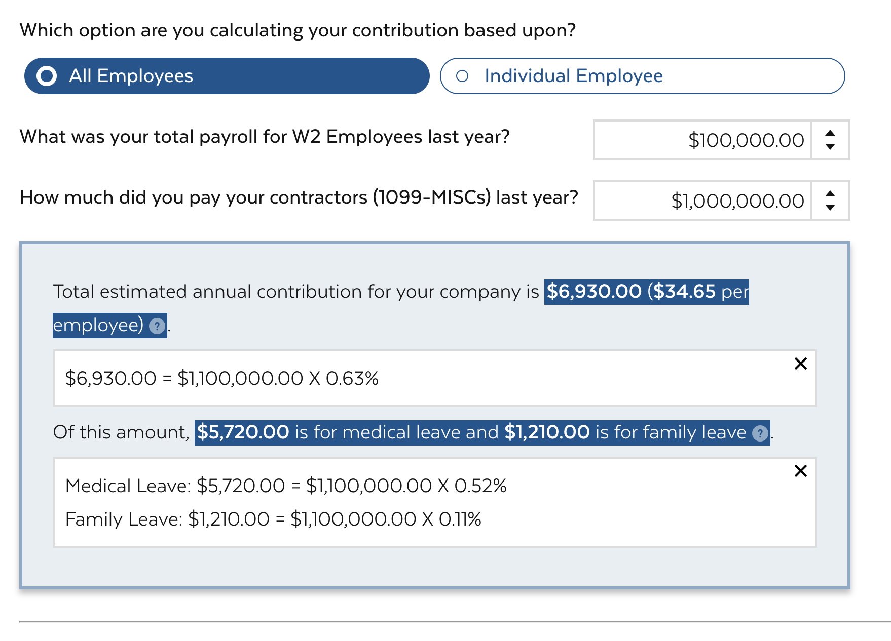
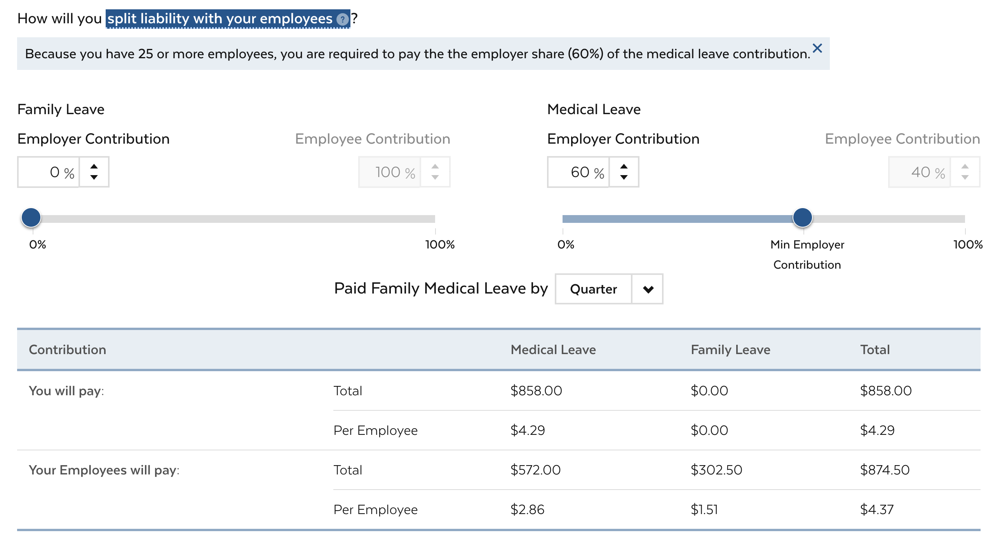

# PFML: Contribution Calculator (Calculator 1)

Welcome to the Commonwealth of Massachusetts' Single Page Application (SPA), powering the Paid Family Medical Leave Contribution Calculator. This is a static website built with React, [Mayflower React](https://github.com/massgov/mayflower/) (Commonwealth's Design System), and our [Mayflower React Starter](https://github.com/massgov/mayflower-react-starter/). The [Mayflower React Starter](https://github.com/massgov/mayflower-react-starter/) is a customized instance of [Facebook's Create React App](https://github.com/facebook/create-react-app).

## Quick start

- $ ``git clone git@github.com:massgov/calculators.git``
- $ ``cd PFML/CalculatorOne``
- $ ``npm install``
- $ ``npm start``
- Browse to http://localhost:3000/, or the custom port shown in the output of `npm start`.

## System Requirements

- node.js, currently standardized on version 10.10.0
- npm, currently standardized on version 6.4.1
- That's it! All other dependencies should be included when you run ``npm i``.
- While not a strict requirement, we **highly recommend** the use of nvm to facilitate easily switching between versions of nodejs. Instructions on getting it set up are [here](https://github.com/creationix/nvm#installation).

## Useful commands

The most common commands can be found in the package.json's ``scripts`` section:

- $ ``npm install`` installs all the package dependencies.
- $ ``npm start`` Starts the local development server. By default runs on port 8000.
- $ ``npm run build`` Builds the static site in the [./build](./build). This command will build the static SPA using based on the root `homepage` specified in [package.json](./package.json#L3).
- $ ``serve`` Serves the spa site locally. By default will serve the file from port 5000 in the path specified by the homepage in package.json at build time
- $ ``npm run lint`` and ``npm run lint-fix`` Runs eslint code style checks, with the ``-fix`` added it will attempt to auto-correct any found issues.

## Structure

### Part 1
- [Part 1 source code](./src/components/Form/Part1.js)
- The text powering Part 1 of the calculator is found in the data file [PartOne.json](./src/data/PartOne.json).

### Part 2
- [Part 2 source code](./src/components/Form/Part2.js)
- The text powering Part 2 of the calculator is found in the data file [PartTwo.json](./src/data/PartTwo.json)

### Part 3
- [Part 3 source code](./src/components/Form/Part3.js)
- The text powering Part 3 of the calculator is found in the data file [PartThree.json](./src/data/PartThree.json)

### Form
- The code merging parts 1-3 together and providing the context is [ExampleForm](.src/component/ExampleForm)

### Base Variables
- The [Base Variables](./src/data/CalculatorOneVariables.json) that power the logic behind the calculators messaging and calculations are located in the base variables json.

