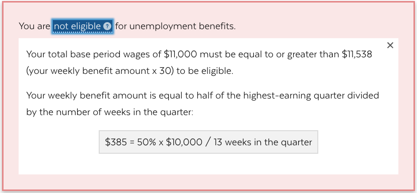
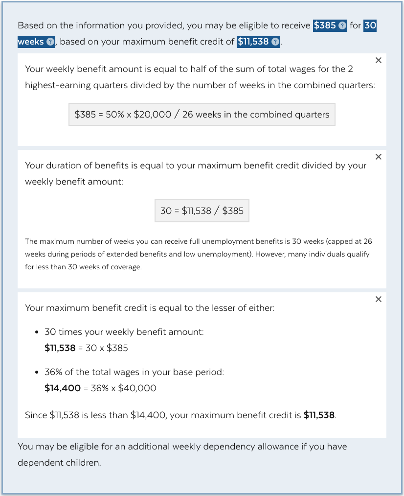
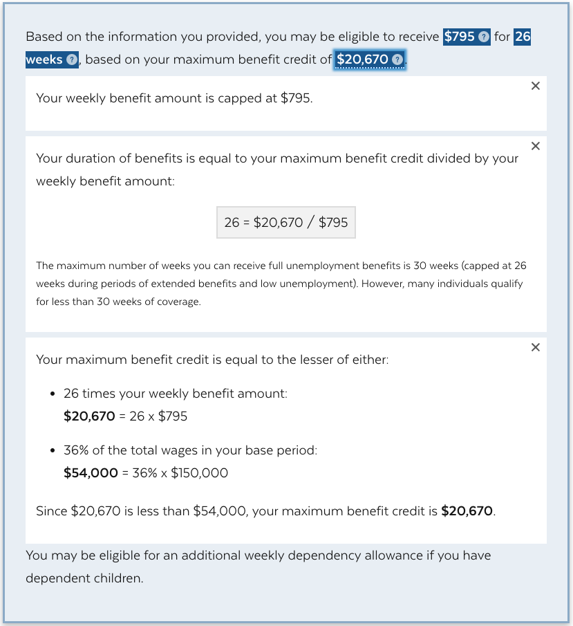

# Calculator Logic
The main logic of the calculator live in these files:
- [Input](../src/components/Form/index.js)
- [Output](../src/components/Form/output.js)
- [Variables](../src/data/variables.json)

----
To change max benefit duration from 26 weeks to 30 weeks, change `maxBenefitDuration` in [Variables](../src/data/variables.json) to `30`.
> This variable will impact the formula of calculating the maxBenefit total and hence the benefits duration outcome.

----

## Input

Input consists of 4 currency input for total quarterly wages, 1 checkbox for apply first quarter wages to all and a submit button.


### Currency input:
The labels for the 4 currency input are calculated based date ranges based on the current date.
Quarter date range calculation logic:
```
const quarterCurrent = moment().quarter();
const quarterDateRange = (quartersAgo) => {
  const quarter = quarterCurrent - quartersAgo;
  let qEnd = moment().quarter(quarter).endOf('quarter');
  let qStart = moment().quarter(quarter).startOf('quarter');
  qEnd = moment(qEnd).format(format);
  qStart = moment(qStart).format(format);
  return{ qEnd, qStart };
};
```

### Checkbox:
The apply-to-all checkbox is added for the convenience of the users inputing the same quarterly income for the last 4 quarters. Checking the box will keep the other 3 currency inputs in sync with the value in the first currency input; unchecking the box will break out of the sync and let the user edit the value in each of the other 3 currency inputs.

### Submit Button:
The submit button will take the values from the user input and render the new output below.


## Output

### Eligibility
1. qualification 1: total wages is no less than the threshhold $4700 (`quartersSumThreshhold` in [Variables](../src/data/variables.json))
```
  const qualification1 = !(quartersSum < quartersSumThreshhold);
```


2. qualification 2: total wages is no less than 30 times the weeklyBenefitFinal
```
  const qualification2 = !(quartersSum < (30 * weeklyBenefitFinal));
```


To test this rule, put in 2 quarters wages, with the lower quarter's wage less than 2/13 of the higher quarter's wage.
```
For 2 quarters and Q1 >= Q2
Q1 + Q2 >= 30 * 1/2 * Q1 / 13
Q1 + Q2 >= 15 /13 * Q1
Q2 >= 2/13 * Q1
Q2 >≈ 0.153846 Q1
```
e.g.
```
Q1: $10,000
Q2: $1,538 or anything amount that is less than $1,538
```
[Outstanding questions about this rule](./questions.md)


### Benefits Calculation
#### Weekly benefit calculation:
```
  let topQuarters;
  let weeksInTopQuarters = 26;
  if (quartersCount > 2) {
    topQuarters = quartersHaveValue.sort((q1, q2) => q2 - q1).slice(0, 2);
  } else if (quartersCount > 0) {
    topQuarters = quartersHaveValue.sort((q1, q2) => q2 - q1).slice(0, 1);
    weeksInTopQuarters = 13;
  }
  const topQuartersSum = topQuarters && topQuarters.length > 0 && topQuarters.reduce(sum);
  const weeklyBenefit = 1 / 2 * topQuartersSum / weeksInTopQuarters;
```


If max weekly benefits $795 reached set weekly benefits to `weeklyBenefitMax` in [Variables](../src/data/variables.json)
```
const weeklyBenefitFinal = weeklyBenefit > weeklyBenefitMax ? weeklyBenefitMax : weeklyBenefit;
```


#### Max benefits credit calculation:
```
const maxBenefitOption1 = maxBenefitDuration * weeklyBenefitFinal;
const maxBenefitOption2 = maxBenefitRatio * quartersSum;
const maxBenefitFinal = maxBenefitOption1 > maxBenefitOption2 ? maxBenefitOption2 : maxBenefitOption1;
const maxBenefitOther = maxBenefitOption1 > maxBenefitOption2 ? maxBenefitOption1 : maxBenefitOption2;
```

#### Benefits duration calculation:
```
const benefitDuration = maxBenefitFinal / weeklyBenefitFinal;
```
