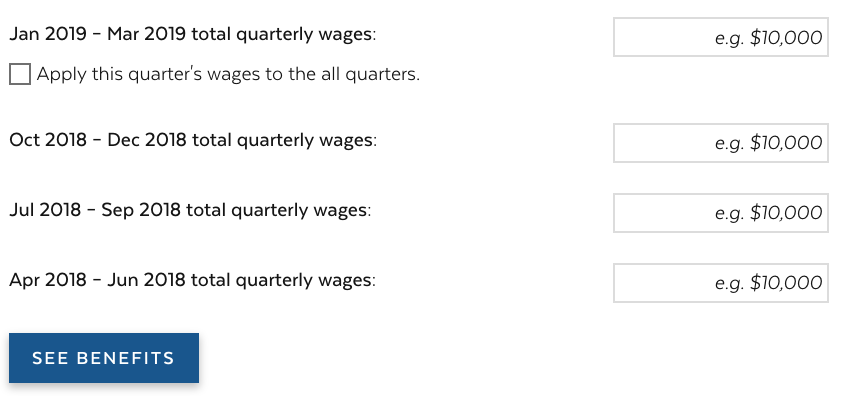
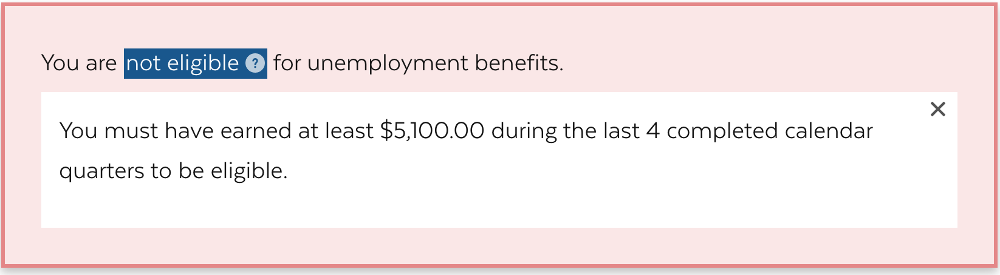
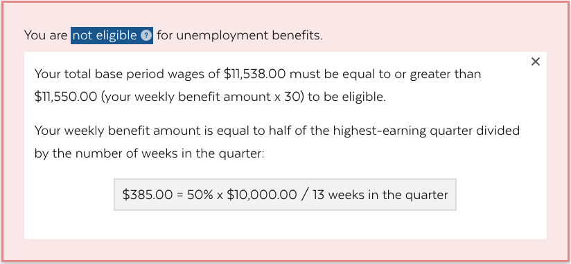
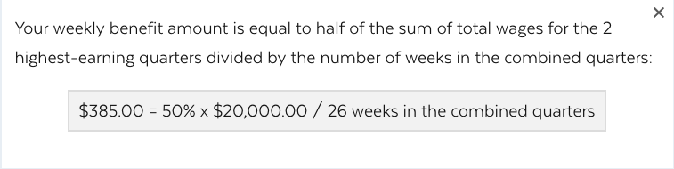
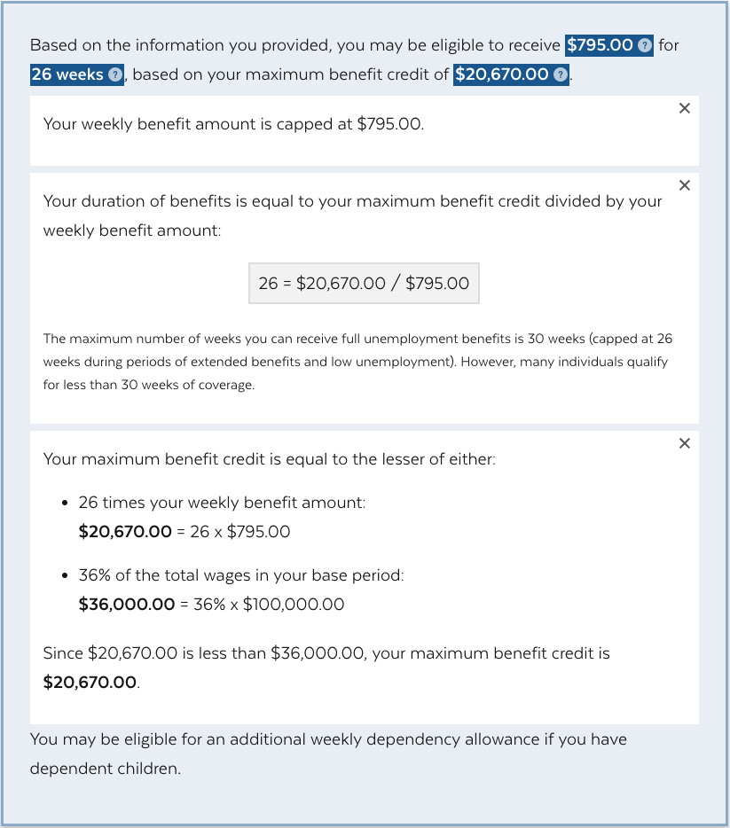
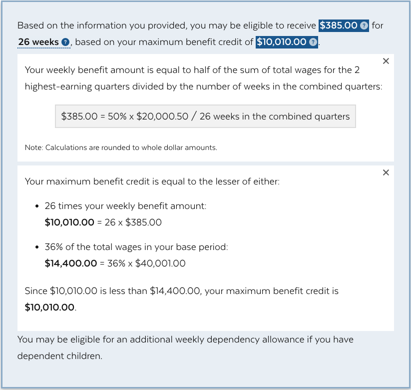
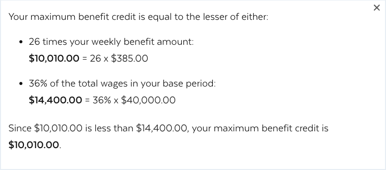
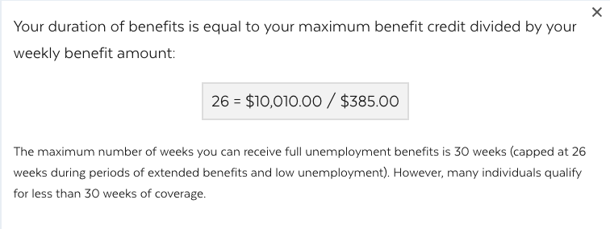

# Unemployment Benefits calculator documentation
Use this documentation to learn where the formulas live and how the calculator formula was created.
## Calculator Logic
The calculator takes in up to 4 inputs from the user for each of their quarterly wages, and tells the user if they are eligible to receive benefits or not. If they may be eligible to receive benefits, the calulator tells the user: (1) weekly benefit amount, (2) number of weeks they'll receive benefits, and (3) maximum benefit credit amount.
The main logic of the calculator lives in these files:
- [Variables](../src/data/variables.json)
- [Input](../src/components/Form/index.js)
- [Output](../src/components/Form/output.js)

## Variable constants
There are 4 variables that are constants. Here are their values:
```
maxBenefitDuration = 26
quartersSumThreshhold = 5400
weeklyBenefitMax = 823
maxBenefitRatio = 0.36
```

To change max benefit duration from 26 weeks to 30 weeks, change `maxBenefitDuration` in [Variables](../src/data/variables.json) to `30`.
> This variable will impact the formula of calculating the maxBenefit total and hence the benefits duration outcome.

## Inputs

Inputs consist of 4 currency inputs for total quarterly wages. The user can use the checkbox to apply the first quarter wages to all quarters. Once they add the wages, they click the "See benefits" button.

*Image 1: Input fields in the calculator*



### 1. Currency input
The labels for the 4 currency inputs are date ranges calculated based on the current date. This is the quarter data range calculator logic:
```
const quarterCurrent = moment().quarter();
const quarterDateRange = (quartersAgo) => {
  const quarter = quarterCurrent - quartersAgo;
  let qEnd = moment().quarter(quarter).endOf('quarter');
  let qStart = moment().quarter(quarter).startOf('quarter');
  qEnd = moment(qEnd).format(format);
  qStart = moment(qStart).format(format);
  return{ qEnd, qStart };
};
```

### 2. Checkbox
The apply-to-all checkbox is added for the convenience of the users inputing the same quarterly income for the last 4 quarters. Checking the box will keep the other 3 currency inputs in sync with the value in the first currency input; unchecking the box will break out of the sync and let the user edit the value in each of the other 3 currency inputs.

### 3. See benefits submit button
The submit button will take the values from the user inputs and render the new output below.


----
## Outputs

The calculator first checks if a person is eligible to qualify for unemployment benefits. If a person is eligible, then it calculates a weekly benefit amount, a max benefit credit amount, and the number of weeks a user will receive benefits.

1. Determining eligibility
  * 1.a Qualification 1
  * 1.b Qualification 2
2. Determining benefits
  * 2.a Weekly benefit amount
  * 2.b Max benefits credit
  * 2.c Benefits duration

### 1. Determining eligibility
There are two eligibility thresholds for the wages to meet for being qualified for unemployment benefits (See `qualification1` and `qualification2`):

#### 1.a Qualification1

The first qualification is that the total wages is no less than the threshold of $5,100. This is the calculation formula:
```
  const qualification1 = !(quartersSum < quartersSumThreshhold);
```
For more details, see `quartersSumThreshhold` in [Variables](../src/data/variables.json).

**Scenario failing to meet qualification 1**
Enter `$1,000.00` in all 4 quarters

*Image 2: Scenario failing to meet qualification 1*


#### 1.b Qualification2
The second qualification is that total wages is no less than 30 times the `weeklyBenefitFinal`. This is the calculation formula:
```
  const qualification2 = !(quartersSum < (30 * weeklyBenefitFinal));
```
**Scenario failing to meet qualification 2**
```
Q1: $10,000
Q2: $1,538 or any amount that is less than $1,550
```
*Image 3: Scenario failing to meet qualification 2*



### 2. Determining benefits
#### 2.a Weekly benefit amount (WBA)
WBA calculation is broken down in 4 steps:

**Step 1.** Determine the top quarters based on the number of quarters that have wages out of the last 4 quarters.
> - If only 2 or less quarters have wages, WBA is equal to half of the highest-earning quarter divided by the number of weeks in the quarter (13).
> - If more than 2 quarters have wages, WBA is equal to half of the sum of total wages for the 2 highest-earning quarters divided by the number of weeks in the combined quarters (26).

This is the calculation formula:
```
  let topQuarters;
  let weeksInTopQuarters = 26;
  if (quartersCount > 2) {
    topQuarters = quartersHaveValue.sort((q1, q2) => q2 - q1).slice(0, 2);
  } else if (quartersCount > 0) {
    topQuarters = quartersHaveValue.sort((q1, q2) => q2 - q1).slice(0, 1);
    weeksInTopQuarters = 13;
  }
  const topQuartersSum = topQuarters && topQuarters.length > 0 && topQuarters.reduce(sum);
```

**Step 2.** Calculate average weekly pay (`avgWeeklyPay`) in the top quarters.
This is the calculation formula:
```
const avgWeeklyPay = Math.ceil(topQuartersSum / weeksInTopQuarters);
```
> Note: average weekly pay is rounded *up* to the nearest dollar.

**Step 3.** Calculate weekly benefit amount (`weeklyBenefit`) based on the average weekly pay from the previous step.
This is the calculation formula:
```
const weeklyBenefit = Math.floor(1 / 2 * avgWeeklyPay);
```
> Note: weekly benefit is rounded *down* to the nearest dollar amount

**Step 4.** Make sure that the final weekly benefit amount (`WeeklyBenefitFinal`) never exceeds the maximum weekly benefits amount (`weeklyBenefitMax`).
This is the calculation formula:
```
const weeklyBenefitFinal = Math.min(weeklyBenefit, weeklyBenefitMax);
```
> Note: `WeeklyBenefitFinal` is used in the calculation of the max benefits credit, benefits duration and the final display of WBA.

For more details, see `weeklyBenefitMax` in [Variables](../src/data/variables.json).

##### Calculating benefits scenarios
This section explains how the calculator displays information to users in different scenarios.

**Scenario where weekly benefit amount does not exceed the maximum**  

Enter `$10,000.00` in all 4 quarters

*Image 4: Scenario where weekly benefit amount does not exceed the maximum*


**Scenario where weekly benefit maximum is reached**   

Enter `$25,000.00` in all 4 quarters

*Image 5: Scenario where weekly benefit maximum is reached*


**Scenario for inputs with cents**   

Enter `$10,000.25` in all 4 quarters

>Note: A rounding disclaimer is displayed in the help text in this scenario.

*Image 6: Scenario for inputs with cents*



#### 2.b Max benefits credit calculation
Here is the calculator formula for the max benefits credit:
```
const maxBenefitOption1 = maxBenefitDuration * weeklyBenefitFinal;
const maxBenefitOption2 = Math.floor(maxBenefitRatio * quartersSum);
const maxBenefitFinal = Math.Floor(Math.min(maxBenefitOption1, maxBenefitOption2));
const maxBenefitOther = Math.max(maxBenefitOption1, maxBenefitOption2);
```
> Note: `quartersSum` will have cents when wages input contains cents, `maxBenefitOption2` is rounded *down* to the nearest dollar.

*Image 7: Max benefit credit explanation display when entering $10,000 in all 4 quarters*


#### 2.c Benefits duration calculation
Here is the calculator formula for calculating benefits duration:
```
const benefitDuration = maxBenefitFinal / weeklyBenefitFinal;
```

*Image 8: Benefits duration explanation display when entering $10,000 in all 4 quarters*

