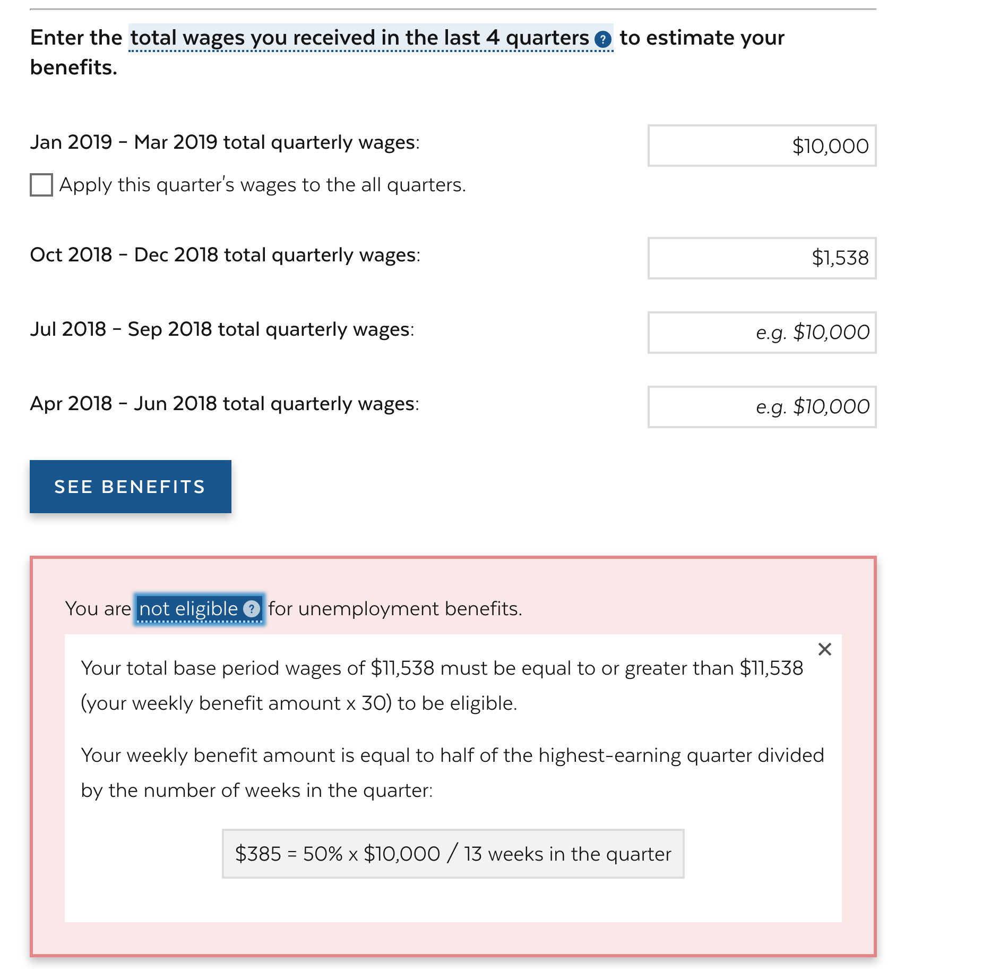

# Question:
how should handle this edge case for rounding:

```
WBA = 50% * 10000 / 13 ≈ 384.615
30 * WBA minimum threshhold ≈ 11538.45
Total wages = 11538
```

In this case, the claimant should be ineligible. But the message we show is:
Your total base period of $11,538 must be equal to or greater than $11,538 (actually 11538.45 but rounded down to 11538) to be eligible.
Based on the message, that's true, $11,538 === $11,538 but actually it's smaller. Should we in this case, show the decimal places for this threshhold number?
