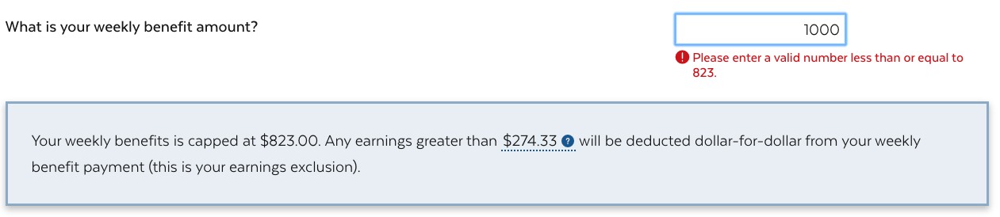
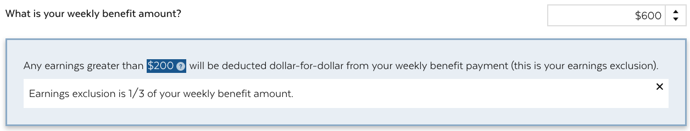
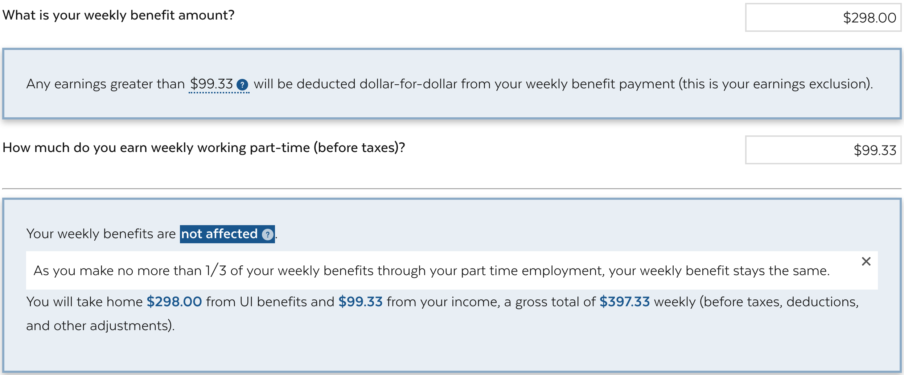
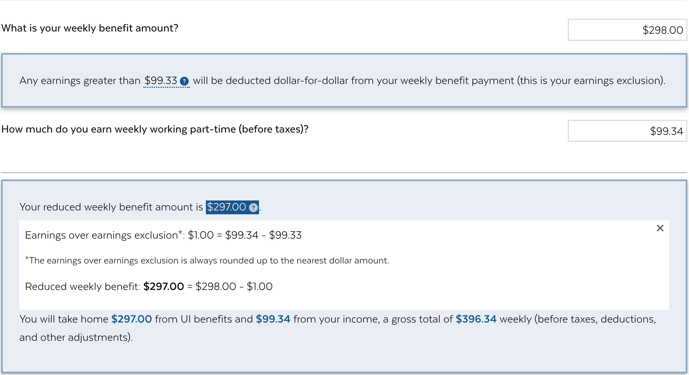

# Part-time benefits calculator documentation
Use this documentation to learn where the formula files live and how the calculator formula was created.

## Calculator Logic
The main logic of the calculator lives in these files:
- [FormProvider](../src/components/Calculator/index.js)
  - [Input](../src/components/Calculator/Inputs.js)
  - Output
    - [Output1](../src/components/Calculator/Output1.js)
    - [Output2](../src/components/Calculator/Output2.js)

# Understanding the formula
The calculator takes in 2 monetary inputs from the user, (1) weekly benefits amount and (2) weekly part-time work earning amount, and calculates 2 outputs, (1) earnings exclusion amount and (2) impact on weekly benefits amount.

The following sections explain the inputs, and the calculations uses to generate the outputs.

## Inputs

[Input](../src/components/Calculator/Inputs.js) consists of 2 currency inputs:
1. Weekly benefit amount (the variable name for this input is `weeklyBenefits`)
2. Weekly part-time work earning (the variable name for this input is `weeklyEarnings`)

*Image 1: Input fields in the calculator*


### 1. Weekly benefit amount (`weeklyBenefits`)

This input is capped at the maximum `$823`. If the user inputs any value larger than `$823`, two things will happen: (1) the input value will automatically be set to `$823`, and they will see an error message explaining that the maximum is `$823`. In technical terms, an input validation along with a message output will be rendered and onBlur the value will be set to the maximum.

*Image 2: Example of the error message*

For more details, see more in `Question1` in [Input](../src/components/Calculator/Inputs.js).

### 2. Weekly part-time work earning (`weeklyEarnings`)

This input is what we'll use to calculate the outputs. Note that users can enter cents for this input.

## Outputs

Each valid set of inputs will generate the corresponding output that is calculated based on the input value. The two outputs are the following:
1. Earnings exclusion (the variable name for this output is `earningsDisregard`)
2. Impact on weekly benefits amount (the variable name for this output is `reducedBenefit`)

### 1. Earnings exclusion (`earningsDisregard`)

Earnings exclusion is calculated based on the weekly benefit amount (`weeklyBenefits`). This is the formula that calculates the earnings exclusion:

```
const earningsDisregardCalc = (weeklyBenefits * (1 / 3));
```
Note that we are rounding the `earningsdisregard` to two decimal places. 

*Image 3: Earning exclusion calculation in the calculator*


For more details, see the calculation in [FormProvider](../src/components/Calculator/index.js)
and to better understand the earnings exclusion output settings, see [Output1](../src/components/Calculator/Output1.js).

### 2. Impact on weekly benefits amount (`reducedBenefit`)

The impact on weekly benefits amount is calculated based on both the weekly part-time work earning amount (`weeklyEarnings`) and on and the earnings exclusion amount (`earningsDisregard`).

There are [three scenarios](../src/components/Calculator/Output2.js) for how part-time earnings will impact the weekly benefit amount:
1. Benefits not impacted
2. Benefits reduced
3. Benefits void


#### 1. Benefits not impacted

This scenario happens when the weekly part-time earnings amount (`weeklyEarnings`) is less than or equal to the earnings exclusion amount (`earningsDisregard`). Below are the formulas for the scenario conditions and the calculation that happens in the scenario.  

**Scenario conditions**

> `weeklyEarnings` <= `earningsDisregard`  
  (or `earningsOverDis` <=0)  

**Calculation formula**
```
const earningsOverDis = weeklyEarnings - earningsDisregard;
```
*Image 4: Benefits not impacted scenario description in the calculator*

For more details, see the conditions in [FormProvider](../src/components/Calculator/index.js).

#### 2. Benefits reduced

This scenario happens when the weekly part-time earnings amount (`weeklyEarnings`) is greater than the earnings exclusion amount (`earningsDisregard`) and the weekly-part time earnings (`weeklyEarnings`) is less than or equal to the weekly benefit amount (`weeklyBenefits`) plus the earnings exclusion amount (`earningsDisregard`). Below are the formulas for the scenario conditions and the calculaton that happens in this scenario.

**Scenario conditions**

> 1. `weeklyEarnings` > `earningsDisregard`
  (or `earningsOverDis` > 0)

> and  

> 2. `weeklyEarnings` <= `weeklyBenefits` + `earningsDisregard`  
(or `reducedBenefit` > 0)

**Calculation formula**
```
const earningsOverDis = Math.ceil(weeklyEarnings - earningsDisregard);
```
> round earningsOverDis up to the next dollar amount (i.e. add $1 and drop the pennies)

```
const reducedBenefit = weeklyBenefits - earningsOverDis;
```
*Image 5: Benefits reduced scenario description in the calculator*

For more details, see the conditions in [FormProvider](../src/components/Calculator/index.js).

#### 3. Benefits void
This scenario happens when the weekly part-time earnings amount (`weeklyEarnings`) is greater than the weekly benefits amount (`weeklyBenefits`) plus the earnings exlusion amount (`earningsDisregard`).  Below are the formulas for the scenario conditions and the calculaton that happens in this scenario.

**Scenario conditions**
>`weeklyEarnings` > `weeklyBenefits` + `earningsDisregard`  
  (or `reducedBenefit` <= 0)  

**Calculation formula**
```
const earningsOverDis = weeklyEarnings - earningsDisregard;
const reducedBenefit = weeklyBenefits - earningsOverDis;
```
*Image 6: Benefits void scenario description in the calculator*

For more details, see the conditions in [FormProvider](../src/components/Calculator/index.js).
